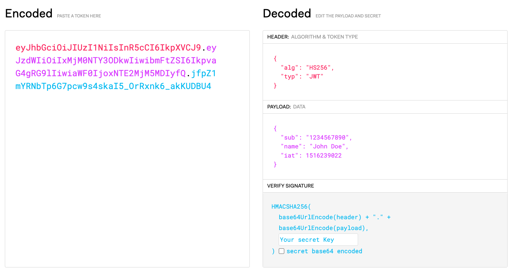
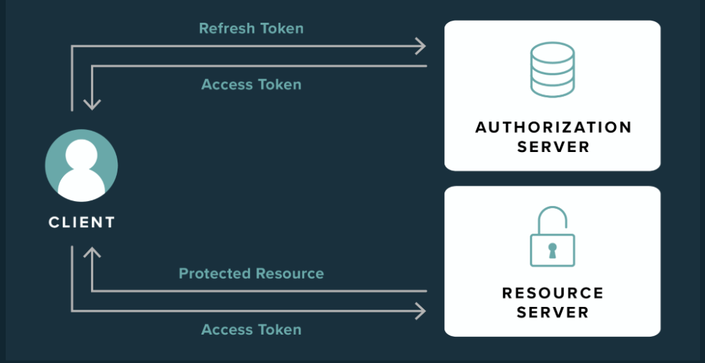
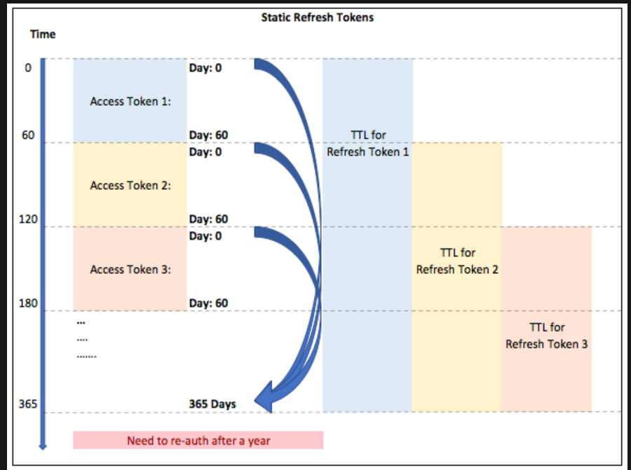
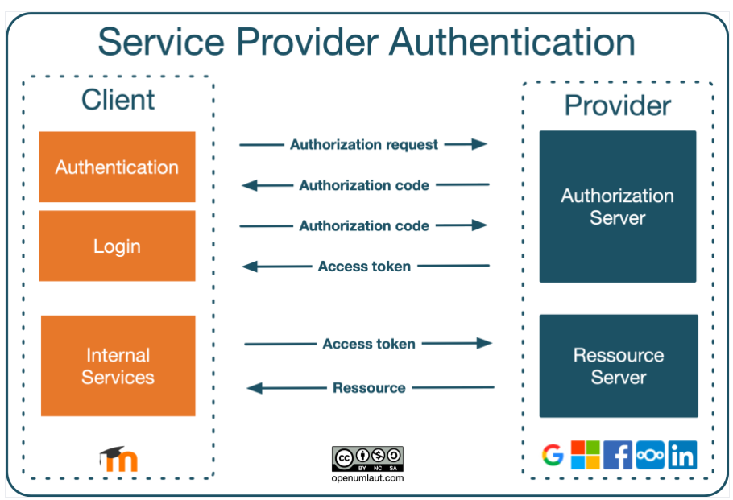
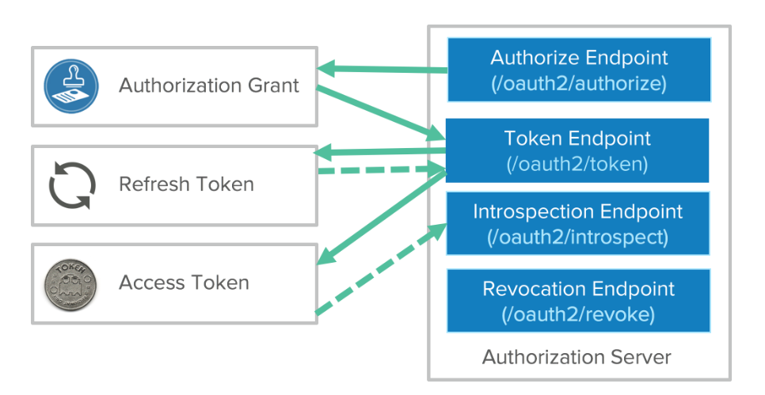

# Guard Documentation

- I will share the right way to security your resources APIs by using JSON Web Token

## JSON Web Token (JWT)

### JWT - What is it

- TL'DR: It is a JSON Object contain information has been encoded as a string with 3 parts divided by dot
  - Head: Contain algorithm and token type
  - Payload: Contain JSON metadata you defined
  - Signature: Has signature which will combine with secret key to verify this token valid or not
  - [Documentation](https://datatracker.ietf.org/doc/html/draft-ietf-oauth-security-topics)
  - [Playground](https://jwt.io/)

### JWT - Why we need

- It stateless! Adapt RestfulAPI standard requirement
- It decoupled! Only the authentication server can provide token, another has secret key can verify it
- It can scale! Scale horizontally as long as secret key is securely
- It immutable! You can change the information inside Jsonwebtoken

### JWT - When we use

- Authentication: You want to know who is it
- Authorization: You want to know they has enough permission to execute this action
- Prevent Tampered: You can sure no-one can fake the information after claims

### JWT - How to implement

- I've code in this module so you can read to figure out
- Should using 2048-4096 bit (prevent brute-force attack)
- Has 2 algorithm popular:
  - HS-512: Using in internal service
  - RS-512: Using with tenant, partner [Documentation](https://auth0.com/blog/navigating-rs256-and-jwks/)

- Each time user sign-in we will provide
  - AccessToken: using access resources (15-30 minutes to expire)
  - RefreshToken: using renewable if access token expired (1-3 months to expire)
  - IdToken (optional): for admin can management resources

- After generate you will storage in [Cookie](https://developer.mozilla.org/en-US/docs/Web/HTTP/Cookies)
  - Enable sameSite -> Browser will only using if domain is match rule
  - Enable httpOnly -> Browser prevent javascript can read & edit (XSS cross-site scripting)
  - Enable secure   -> Browser must has HTTPS will receive

- Prevent hacker
  - Refresh token should be generate each time renew access token without change time expire
  - Refresh token should be 4096 bit to enough strong to hacker can be encrypt
  - Refresh token should be hashing before store in database

### JWT - Cons

- It enough strong to secure but not perfect to defense!!!
  - Hacker: If not secure refresh token. Hacker can stolen via CSRF or XSS
  - Revoke: You can't revoke token you have claims. Everyone who has that can access your resources as you
  - Coding: Need more 1 layer to secure important API (payment, charge, edit permission)

### JWT - Best Practices

- [Don't Revoking Access to JWT tokens with a Blacklist/Deny List](https://supertokens.com/blog/revoking-access-with-a-jwt-blacklist)
- [Refresh token should rotation to prevent brute-force attack](https://auth0.com/blog/refresh-tokens-what-are-they-and-when-to-use-them/)

## Oauth2

### Oauth2 - What is it

- TL'DR: Oauth2 is the internalization standard protocol for authorization and it has 3 parts:
  - Client (end-user)
    - Want to access Resource Server via their account from Authorization Server
  - Authorization Server (Facebook, Github, Google...)
    - The server has the activate client account to provide token & scope
  - Resource Server:
    - The server integration with Authorization Server to verify token

### Oauth2 - Why we need

- You don't want to sign-up & sign-in
- You don't want to remember new username & password
- You don't want to forgot password
- Just remember 1 account Google or Facebook
  - So that you can sign-in every application which has support Google & Facebook Oauth 2.0
- You want has expire-time via using JSON Web Token with scope & permission to share

### Oauth2 - When we use

- With end-user
  - Easier way to sign-in without password

- With business
  - Management: Provide scope | permission | deactivate account user
  - Authenticity: Use real-account so don't need to verify email | verify phone if they has already verified
  - Authorization: Scope to access resources depend on their permission, their companies

- With application:
  - Easier to communication
    - Company A want to share Stripe account with scope 'view.chart' to management chart payment status
    - Company A want to share Shopify account with scope 'view.purchase' to management order status
  - Easier to revoke permission
    - If Company A don't want to share Stripe with this application just revoke refresh-token or limit scope
    - If Company A don't want to share Shopify with this application just revoke refresh-token or limit scope

### Oauth2 - How to implement

- I've code in this module so you can read to figure out
- Remember scope is important
- Remember to storage raw_data and accessToken & Refresh Token
- Remember revoke if user sign-out

### Oauth2 - Best Practices

- [All you need](https://oauth.net/2/)
- [Image The flow it work](https://www.youtube.com/watch?v=CPbvxxslDTU)
